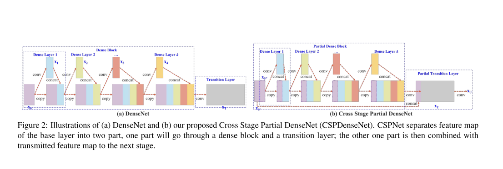
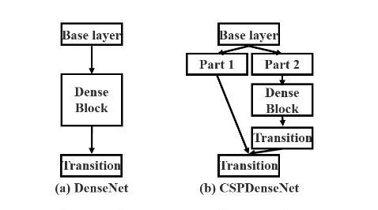

## CSPNet
- 作者 Chien-Yao Wang
- 文章 [CSPNet: A New Backbone that can Enhance Learning Capability of CNN](./paper/CSPNet.pdf)
- 代码 [Code](https://github.com/WongKinYiu/CrossStagePartialNetworks)

  
### 文章简介
在本文中，作者提出了跨阶段局部网络(CSPNet)，用来缓解以往工作需要从网络架构角度进行大量推理计算的问题，作者把这个问题归结为网络优化中的「重复梯度信息」。
CSPNet通过整合网络阶段开始和结束的特征图来尊重梯度的可变性，在我们的实验中，该方法减少了20%的计算量，在ImageNet数据集上具有相当、甚至更高的精度，并且在MS COCO目标检测数据集上的AP50方面显著优于最先进的方法。
除此之外，CSPNet易于实现，并且足够通用，可以处理基于「ResNet」、「ResNeXt」和「DenseNet」的体系结构。
### 模块介绍
1. Cross Stage Partial Network  
y = F(x0) = xk = Hk(xk-1, Hk-1(xk-2),...H1(x0),x0)  

2. Exact Fusion Model