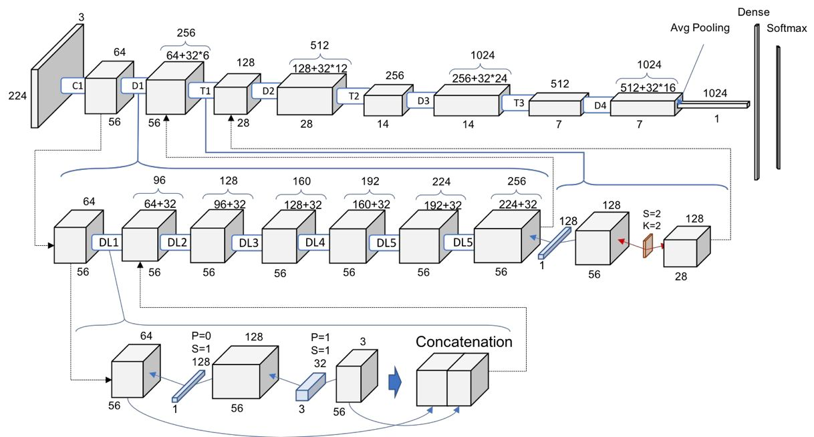
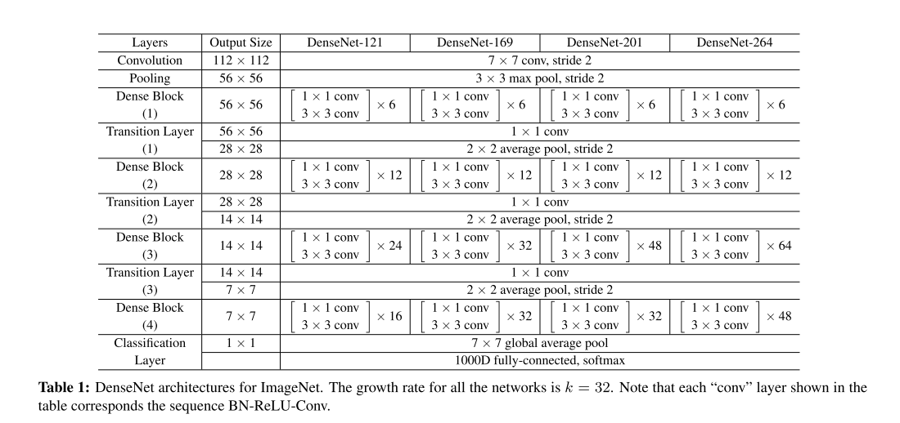

## DenseNet
- 作者 Gao Huang
- 文章 [Densely Connected Convolutional Networks](./paper/DenseNet.pdf)
- 代码 [Code](https://github.com/liuzhuang13/DenseNet)  

### 文章简介
文章提出的DenseNet（Dense Convolutional Network）  
主要还是和ResNet及Inception网络做对比，思想上有借鉴，但却是全新的结构，网络结构并不复杂，却非常有效！众所周知，最近一两年卷积神经网络提高效果的方向，要么深（比如ResNet，解决了网络深时候的梯度消失问题）要么宽（比如GoogleNet的Inception），而作者则是从feature入手，通过对feature的极致利用达到更好的效果和更少的参数。
### 模块介绍
1. Dense Block
2. Composite function
3. Pooling Layer
4. Transition Layer

#### Dense Block
#### Composite function
 BatchNormalLayer+Relu+Conv(3X3)
#### Pooling Layer
 BatchNormalLayer+CONV(1X1)+AveragePooling(2X2)
#### Transition Layer
 Conv(1X1)+AveragePooling(2X2)

### 网络结构

