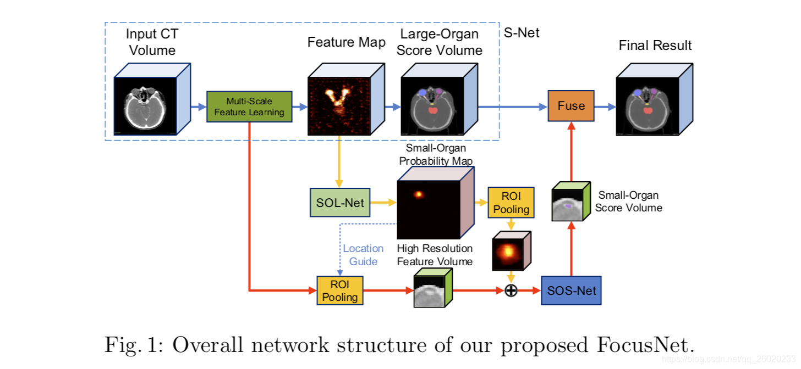
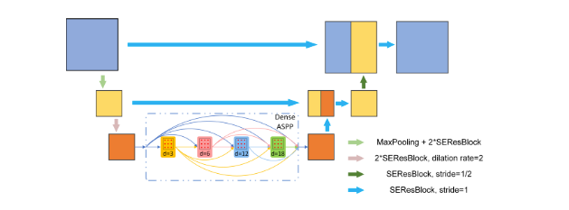

## FocusNet
- 作者 Yunhe Gao
- 文章 [FocusNet: Imbalanced Large and Small Organ Segmentation with an End-to-End Deep Neural](./paper/FocusNet.pdf)
- 代码 [Code](None)

### 文章简介
器官分割是医学影像处理中的一类主要任务，现在主流的方法是采用卷积神经网络进行处理。但是不同的器官之间的大小具有很大的差距，如上图所示，晶状体（最小的器官）只占整个3D空间的0.0028%，而腮腺所占区域大约是晶状体的250倍，不同器官之间所占空间的比例是不平衡的。然而，现有的分割神经网络并没有针对这个问题进行优化，这些网络一般能对大器官产生准确的分割图，但对小器官的分割精度往往是不高的。
为了解决上述大小器官分割任务中存在的占比不平衡问题，这篇文章模拟了专家标注的过程。作者发现，对于大器官，专家通常在正常视图下进行标注，而对于小器官，他们先在正常视图下找到对应的位置，然后放大进行标记。受此启发，这篇文章提出了一种新颖的端到端三维卷积神经网络 (FocusNet)，同时对大器官和小器官产生精确的分割。

### 模块介绍
1. S-Net多尺度主分割网络  
   主分割网络的作用是对所有器官进行分割，同时学习多尺度的特征作为后续操作的输入。它的网络结构可以看作是魔改版的3D UNet[8]， 针对本任务做出了几个针对性的修改。
原始的UNet通过卷积和降采样交替进行4次，得到高维的特征图，之后再通过对称的卷积上采样操作4次恢复空间分辨率，并通过short-cut连接将相同分辨率的特征图融合,以补充由降采样带来的细节损失。
然而由于小器官体积非常之小，且由于头颈部重要器官较多，拍摄CT时只能接受较小的辐射剂量，CT的层间分辨率仅为3mm，导致有些小器官只在相邻的1-3帧中出现,降采样会对这些小器官有灾难性的影响。
因此我们的主分割网络只降采样了一次。然而降采样次数减少之后感受野大小会大大降低，导致网络难以捕捉到更高维的信息，从而影响大器官的分割效果，因此我们进一步加入了空洞卷积以及dense ASPP[10]来扩大感受野同时捕捉多尺度的特征。
为了提升网络的特征学习能力，我们使用了加入Squeeze-Excitation[3]层的ResBlock来搭建网络。

2. SOL-Net 小器官分割网络  
   即使加入了上述网络设计方法,只能说是提高了小器官分割准确度,并没有从根本上解决这个问题。
我们观察到医生在勾画这些器官时，通常是将视角放大，对每个小器官进行精确勾画。我们通过小器官定位网络和分割网络来模拟医生的这个操作，即使用定位网络找到小器官的位置，之后将每个小器官裁切出来并送入分割分支进行二类分割。
小器官定位网络使用关键点定位中回归heatmap的方法，输入为主分割网络解码器部分的最后一个卷积层输出的特征图，训练目标为每个小器官中心位置概率图，即以小器官中点为中心的3D高斯分布。
根据小器官的位置，我们将小器官附近区域作为感兴趣区域，将其特征图、heatmap和原图裁剪并堆叠在一起，作为小器官网络的输入，输出为每个小器官的二类分割结果。这样就彻底解决了大小器官不均衡的问题，每个小器官有自己的分支，互不冲突。同时原始图像可以向多尺度特征图中加入更多原始高分辨率信息以提高分割的精细程度。
3. 损失函数  
   主分割网络和小器官分割网络都是用Focal loss[5]和Dice loss作为损失函数，而小器官定位网络使用了MSE loss作为损失函数。在训练时，三个网络依次训练，并在最后进行联合fine-tuning。
