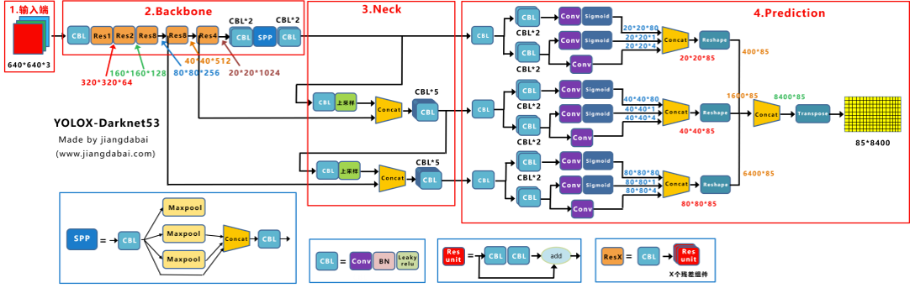
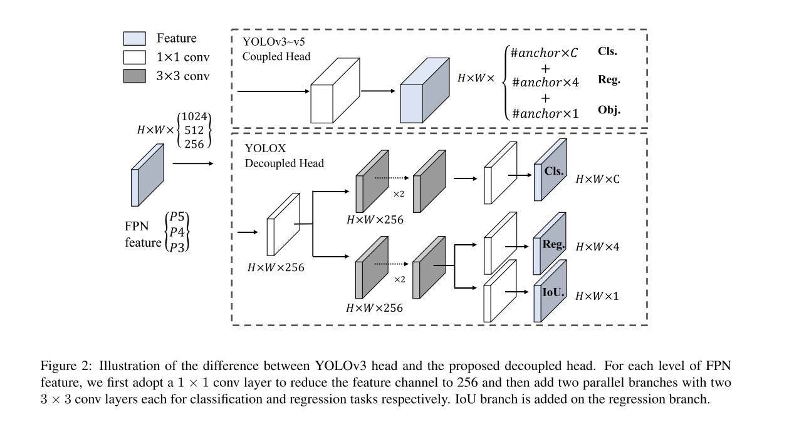

## YOLOX
- 作者 Zheng Ge
- 文章 [YOLOX: Exceeding YOLO Series in 2021](./paper/YOLOX.pdf)
- 代码 [Code](https://github.com/Megvii-BaseDetection/YOLOX)  
  
### 文章简介  
绍了对 YOLO 系列的一些经验改进，形成了一种新的高性能检测器——YOLOX。 我们将 YOLO 检测器切换为无锚方式并进行其他高级检测技术，即解耦头和领先的标签分配策略 SimOTA，
### 模块介绍
1. backbone  
 yolox使用darknet为基础的backbone，
2. neck
3. head
   1. simOTA
   2. Decoupled Head
4. 数据增强策略
5. 和yolov3的区别  

